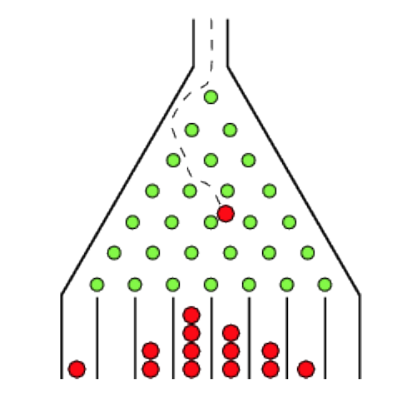

# Project Definition
The Galton board is a device for statistical experiments named after English scientist Sir Francis Galton.
It consists of an upright board with evenly spaced nails (or pegs) driven into its upper half, where the
nails are arranged in staggered order, and a lower half divided into a number of evenly-spaced
rectangular slots. The front of the device is covered with a glass cover to allow viewing of both nails
and slots. In the middle of the upper edge, there is a funnel into which balls can be poured. The funnel
is located precisely above the central nail of the second row so that each ball, if perfectly centered,
would fall vertically and directly onto the uppermost point of this nail's. Each time a ball hits one of the
nails, it can bounce right (or left) with `equal probability`.



In the project, you asked to implement this idea using threads in Java programming language. You can
consider the ball in the above figure as threads and rectangular slots as array cells.

You need to create a given number of threads if supported by your OS. Also, you need an array to
count incoming threads. At any point (green circles in the figure), the thread can move either right or
left. This choice is done randomly. When the thread finished its way, increase the value of the array
cell by one. The below figure presents an example of the program output for a run. The values may
naturally change for each run. Be sure that created thread count is equal to the sum of the values.

# Grading Criteria
* If `mvn compile` does not work, you will get 0 point.
* If you change the pom.xml, package names, class names (given file structure), you will be `penalized`  with 30 points.
* If you don't create the required thread count, you will be `penalized` with 30 points.
* Programming logic and correct output defined in `Tests to run` section below are worth 40 points.

# Requirements
* Fork this github repository.
* Your project should be a maven project.
* Use Java 17 and Apache Maven 3.9.6.
* Do not modify the pom.xml file.
* Check out the Tests to Run section below. Make sure the test outputs match the expected format exactly, except for the numerical values, which may vary.
* Push your changes to your forked repository after completing the assignment.


# Tests to run

### Test 0
```bash
mvn -Dtest=Main0Test test
```

When the  `mvn -Dtest=Main0Test test` command applied ,it should give an output like below. The output of the test should be exactly like this (Only the numbers can change). 

```bash
0       0
1       0
2       2
3       2
4       8
5       30
6       52
7       94
8       127
9       155
10      187
11      168
12      95
13      52
14      19
15      6
16      3
17      0
18      0
19      0
Number of requested thread: 1000
Sum of Bin values: 1000
Nice work! Both of them are equal
```

### Test 1
```bash
mvn -Dtest=Main1Test test
```

When the  `mvn -Dtest=Main1Test test` command applied ,it should give an output like below. The output of the test should be exactly like this (Only the numbers can change). 

```bash
0       0
1       0
2       6
3       17
4       78
5       226
6       457
7       978
8       1441
9       1777
10      1742
11      1415
12      1002
13      522
14      227
15      80
16      25
17      6
18      1
19      0
Number of requested thread: 10000
Sum of Bin values: 10000
Nice work! Both of them are equal
```

### Test 2
```bash
mvn -Dtest=Main2Test test
```

When the  `mvn -Dtest=Main2Test test` command applied ,it should give an output like below. The output of the test should be exactly like this (Only the numbers can change). 

```bash
0       0
1       0
2       0
3       0
4       0
5       2
6       6
7       35
8       89
9       172
10      366
11      676
12      959
13      1305
14      1410
15      1458
16      1307
17      951
18      618
19      331
20      189
21      88
22      25
23      6
24      6
25      1
26      0
27      0
28      0
29      0
Number of requested thread: 10000
Sum of Bin values: 10000
Nice work! Both of them are equal
```
